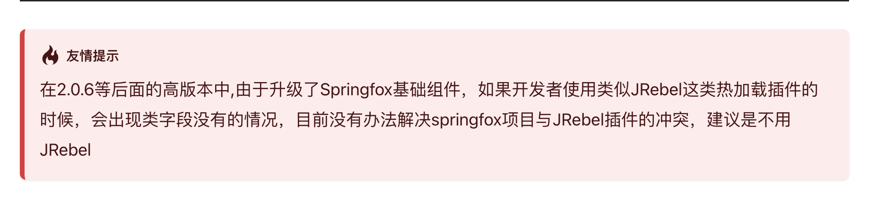

# 简介

基于springcloud alibaba搭建的微服务项目。每个服务基于alibaba cola搭建结构。

https://github.com/alibaba/COLA

https://blog.csdn.net/significantfrank/article/details/110934799

# 快速上手

1.根据==release（cola2）==创建分支

2.修改为本地环境，==切勿将本地的配置上传到git上==

修改所有bootstrap文件

- 修改nacos的ip，nacos注册中心的namespace，nacos配置中心的namespace
- 修改spring.profiles.active的值为local


3.将项目下的nacosConfig文件夹压缩，导入到自己的nacos命名空间中。


4.启动：GatewayApplication、ConsumerApplication、ProviderApplication

访问：http://127.0.0.1:7001/doc.html#/home

（后续修改nacos配置及时同步到代码内的文件，以防配置不一样别人项目起不起来）

# 包结构

大体包结构，待完善

```
ztozy-freight-system
└── freight-common -- 通用common包，基础入参出参，常量，枚举，响应状态码，异常，工具类
└── freight-components -- 中间件管理
     ├── freight-components-mq -- MQ
     └── freight-components-redis -- redis
├── freight-gateway -- 网关，所有微服务的统一入口
├── freight-consumer -- 测试服务
└── freight-provider -- 测试服务
```

单服务结构：

```
freight-provider
├── freight-provider-adapter -- 适配层，类似controller，区分Web，Mobile，WAP
└── freight-provider-app -- 应用层，定义服务实现，先按照业务分包，再按照功能分包（以及消息队列的消费者和定时任务等）
     ├── consumer -- 处理外部message
     └── scheduler -- 处理定时任务
└── freight-provider-client --  定义服务dubbo/feign
     ├── api -- 定义服务接口
     └── dto -- 存放传输实体
├── freight-provider-common -- 该模块的common包
├── freight-provider-domain -- 领域层，核心业务逻辑
├── freight-provider-infrastructure -- 基础设施层，数据库的CRUD、搜索引擎、文件系统、MyBatis的mapper等
└── freight-provider-start -- 启动模块和全局相关配置
```


# 技术选型

| 框架                 | 版本          | 备注                      |
| -------------------- | ------------- | ------------------------- |
| spring-boot          | 2.3.2.RELEASE |                           |
| spring.cloud         | Hoxton.SR9    |                           |
| spring.cloud.alibaba | 2.2.6.RELEASE |                           |
| nacos                | 1.4.2         | 注册中心和配置中心        |
| feign                |               | 服务调用                  |
| dubbo                | 2.7.15        | 服务调用                  |
| Sentinel             | 1.8.1         | 限流，服务熔断降级        |
| spring-cloud-gateway |               | 微服务网关                |
| sleuth               |               | 链路追踪                  |
| Redisson             | 3.15.0        | 分布式锁                  |
| hutool               | 5.8.5         | 工具类                    |
| easyexcel            | 3.1.1         | 处理excel                 |
| rocketmq             | 4.8.0         | 消息队列                  |
| mybatis-plus         | 3.5.2         | DAO层框架                 |
| dynamic-datasource   | 3.5.1         | 多数据源                  |
| mapstruct            | 1.5.2.Final   | 对象赋值                  |
| knife4j              | 3.0.3         | 在线接口文档，swagger增强 |
| smart-doc            |               | 离线rest和dubbo接口文档   |
| spring cache         |               | 缓存门面                  |
|                      |               |                           |
|                      |               |                           |


# 最佳实践

1.不允许使用JSONObject，map来作为入参出参

2.入参继承Request（普通），PageRequest（分页）；统一返回体使用BaseResponse.ok()，PageResponse.ok()，并指定泛型

3.抛出自定义业务异常:throw new BizException();

4.返回状态码定义在ApiCodeEnum

5.全局异常处理：GlobalExceptionHandler，DubboCustomFilter

6.ServiceConstant统一维护已有feign服务

7.多数据源dynamic-datasource


配置文件配置多组数据库配置，key作为@com.baomidou.dynamic.datasource.annotation.DS("uka_ntocc")的值，然后创建自定义注解UKA_NTOCC_DB，在mapper和serviceimpl上加注解,示例:@UKA_NTOCC_DB


8.swagger在线接口文档:http://127.0.0.1:7001/doc.html

==目前发现使用JRebel热部署插件启动的时候可能会解析不出返回值==



```java
@Api(tags = ""):作用于controller
@ApiOperation(value = "", notes = ""):作用于controller接口
@ApiImplicitParam(paramType = "query", dataType = "int", name = "id", value = "id"):用于@RequestParam参数
@ApiModel(description = ""):作用于对象
@ApiModelProperty("ID"):作用于字段
```

9.smart-doc接口文档，基于注释，生成rest接口文档和dubbo接口文档


10.sleuth链路追踪，根据traceId搜索日志，rest请求，feign调用，dubbo调用，MQ消费，多线程中子线程继承主线程的traceId


11.spring cache缓存门面，简化缓存的CRUD

```java
@CacheConfig(cacheNames = ""):统一配置缓存名称
@Cacheable(key = "#id"):缓存数据或者获取缓存数据
@CachePut(key = "#vo.id"):修改缓存数据
@CacheEvict(key = "#id"):清空缓存
```


12.rocketmq原生使用方式：IMQSender

```java
引入依赖：
				<dependency>
            <groupId>com.zto56</groupId>
            <artifactId>freight-components-mq</artifactId>
        </dependency>

    @Autowired
    private IMQSender imqSender;
```


13.redis使用：

```java
引入依赖：
        <dependency>
            <groupId>com.zto56</groupId>
            <artifactId>freight-components-redis</artifactId>
        </dependency>

    @Autowired
    private RedisUtil redisUtil;
```

Redisson加锁：

```java
    @Autowired
    private RedissonLock redissonLock;
```

14.参数校验：

方案一：基于Hibernate Validator

有弊端：不能用于除controller之外的方法上

https://juejin.cn/post/6854573221938020360

注意都是==javax.validation==的包

```java


@Validated	用于@RequestBody入参实体校验和controller上
@NotNull(message = "")
@NotBlank(message = "")
@Valid 嵌套校验
```

想要在任意方法上使用，示例：

```java
    @Autowired
    private ValidateService validateService;
    
    validateService.validate(obj);
```


方案二：基于hutool的[Assert](https://hutool.cn/docs/#/core/语言特性/断言-Assert?id=断言-assert)

```
Assert.isTrue(1 == 2, "我报错啦");

isTrue 是否True
isNull 是否是null值，不为null抛出异常
notNull 是否非null值
notEmpty 是否非空
notBlank 是否非空白符
notContain 是否为子串
notEmpty 是否非空
noNullElements 数组中是否包含null元素
isInstanceOf 是否类实例
isAssignable 是子类和父类关系
state 会抛出IllegalStateException异常
```


方案三：mars-validated

https://github.com/fashionbrot/mars-validated

可以作用于任意方法上的入参，方法上面加入参：@Validated

注意都是==com.github.fashionbrot.validated==这个包

| NotBlank       | String                                                       | 验证String 字符串是否为空  |
| -------------- | ------------------------------------------------------------ | -------------------------- |
| NotNull        | String,Object,Integer,Long,Double,Short,Float,BigDecimal, BigInteger | 验证对象是否为空           |
| NotEmpty       | String                                                       | 验证字符串不能为空         |
| AssertFalse    | Boolean,boolean,String                                       | 只能为false                |
| AssertTrue     | Boolean,boolean,String                                       | 只能为true                 |
| BankCard       | String                                                       | 验证银行卡                 |
| CreditCard     | String                                                       | 验证信用卡                 |
| Default        | Integer,Double,Long,Short,Float,BigDecimal,String            | 设置默认值                 |
| Digits         | String                                                       | 验证是否是数字             |
| Email          | String                                                       | 验证是否是邮箱             |
| IdCard         | String                                                       | 验证是否是身份证，验证18岁 |
| Length         | int,long,short,double,Integer,Long,Float,Double,Short,String | 验证长度                   |
| Pattern        | String                                                       | 正则表达式验证             |
| Phone          | String                                                       | 验证手机号是否正确         |
| Size           | object[],boolean[],byte[],char[],double[],float[],int[],long[],short[],String length,Collection,Map | 验证大小值                 |
| NotEqualLength | String                                                       | 验证长度                   |


15.dubbo

不需要通过xml配置

调用UKA：

```java
    @DubboReference
    private TestServiceI testServiceI;
```

项目内调用：


引用

```java
    @DubboReference
    private ByeService byeService;
```


16.异常日志打印

elk中日志换行不能打印完整异常栈，排查问题很麻烦，可以参考下面的方式打印

```java
        log.error("msg:{} e:{}", e.getMessage(), Arrays.toString(e.getStackTrace()));
```

17.工具类推荐：hutool

https://hutool.cn/

18.nacos配置根据服务做了拆分，也定义了共享配置文件，方便多个服务同时引用

```
动态刷新：类上加注解
@RefreshScope
```

19.操作日志

https://github.com/qqxx6661/logRecord


```java
    @OperationLog(bizId = "#vo.id",
            bizType = OperationType.TEST,
            msg = "'狗狗' + #vo.name",
            tag = "'标签'",
            operatorId = "'张三'",
            recordReturnValue = true,
            condition = "#vo.id!=1")
    @ApiOperation(value = "日志测试1", notes = "日志测试1", httpMethod = "POST")
    @PostMapping("/test1")
    public BaseResponse<DogVO> test1(@RequestBody DogVO vo) {
        // Assert.isTrue(1 == 2, "我报错啦");
        log.info("vo:{}", JSON.toJSONString(vo));
        return BaseResponse.ok(vo);
    }
```


19.操作日志

https://github.com/qqxx6661/logRecord

在方法上加@OperationLog注解

```
bizId：业务ID
bizType：业务类型
msg：日志内容
tag：日志标签
operatorId：操作人ID
recordReturnValue：是否记录返回值
condition：是否记录日志，满足条件的时候才记录日志
```

支持SpEL表达式，SpEL 可以使用方法中的任何参数，三目表达式，调用方法（T()）

```
日志实体包含以下字段

logId：生成的UUID
bizId：业务唯一ID
bizType：业务类型
exception：函数执行失败时写入异常信息
operateDate：操作执行时间
success：函数是否执行成功
msg：日志内容
tag：自定义标签
returnStr: 方法执行成功后的返回值（字符串或JSON化实体）
executionTime：方法执行耗时（单位：毫秒）
extra：额外信息
operatorId：操作人ID
List<diffDTO>: 实体类对象Diff数据，包括变更的字段名，字段值，类名等
```

操作人可以通过注解指定也可以通过实现一个接口（暂未实现，只写了入口）

日志的具体处理也未实现，暂时只是日志打印

```
1.可以直接使用的自定义参数
_return：原方法的返回值
_errorMsg：原方法的异常信息（throwable.getMessage()）

示例：msg = "#_return"

2.可以直接使用的自定义函数：
_DIFF：展示对象的差异之处

```


```java
example：
		@OperationLog(bizId = "#vo.id",
            bizType = OperationType.TEST,
            msg = "T(cn.hutool.core.date.DateUtil).date()+ ' 狗狗:' + #vo.name",
            tag = "'标签'",
            operatorId = "'张三'",
            recordReturnValue = true,
            condition = "#vo.id!=1")
    @ApiOperation(value = "日志测试1", notes = "日志测试1", httpMethod = "POST")
    @PostMapping("/test1")
    public BaseResponse<DogVO> test1(@RequestBody DogVO vo) {
        // Assert.isTrue(1 == 2, "我报错啦");
        log.info("vo:{}", JSON.toJSONString(vo));
        return BaseResponse.ok(vo);
    }


    @OperationLog(bizId = "#newOrder.orderId",
            bizType = OperationType.TEST,
            msg = "#_DIFF(#oldObject, #newOrder)",
            tag = "'标签'",
            operatorId = "'张三'",
            recordReturnValue = true)
    @Override
    public void test2(Order newOrder) {
        Order order1 = JMockData.mock(Order.class);

        LogRecordContext.putVariables("oldObject", order1);
    }
```


20.各种O，不建议只用一两个对象在整个数据流中流转，可以使用mapstruct转换

POJO的定义是无规则简单的对象，在日常的代码分层中pojo会被分为VO、BO、 PO、 DTO

**VO （view object/value object）表示层对象**

1、前端展示的数据，在接口数据返回给前端的时候需要转成VO

2、个人理解使用场景，接口层服务中，将DTO转成VO,返回给前台

**B0（bussines object）业务层对象**

1、主要在服务内部使用的业务对象

2、可以包含多个对象，可以用于对象的聚合操作

3、个人理解使用场景，在服务层服务中，由DTO转成BO然后进行业务处理后，转成DTO返回到接口层

**PO（persistent object）持久对象**

1、出现位置为数据库数据，用来存储数据库提取的数据

2、只存储数据，不包含数据操作

3、个人理解使用场景，在数据库层中，获取的数据库数据存储到PO中，然后转为DTO返回到服务层中

**DTO（Data Transfer Object）数据传输对象**

1、在服务间的调用中，传输的数据对象

2、个人理解，DTO是可以存在于各层服务中（接口、服务、数据库等等）服务间的交互使用DTO来解耦

**DO（domain object）领域实体对象**

DO 现在主要有两个版本：

①阿里巴巴的开发手册中的定义，DO（ Data Object）这个等同于上面的PO

②DDD（Domain-Driven Design）领域驱动设计中，DO（Domain Object）这个等同于上面的BO


# 注意点

1.Nacos2.0版本相比1.X新增了gRPC的通信方式，因此需要增加2个端口。Nacos2.0的服务端完全兼容1.X客户端。Nacos2.0客户端由于使用了gRPC，无法兼容Nacos1.X服务端，请勿使用2.0以上版本客户端连接Nacos1.X服务端。

2.springcloud alibaba版本依赖关系：https://github.com/alibaba/spring-cloud-alibaba/wiki/%E7%89%88%E6%9C%AC%E8%AF%B4%E6%98%8E


# TODO

动态开启knife4j

stream rocketMQ

Seata

zipkin/skywalking，链路追踪可视化

prometheus:jvm可视化

springboot admin 服务监控

Swagger枚举自动翻译

Sentinel：服务端限流熔断

基础包打包，各个项目统一使用

打包包含注释和源码

定时任务

操作日志：用户获取，操作日志入库


# 集思广益

